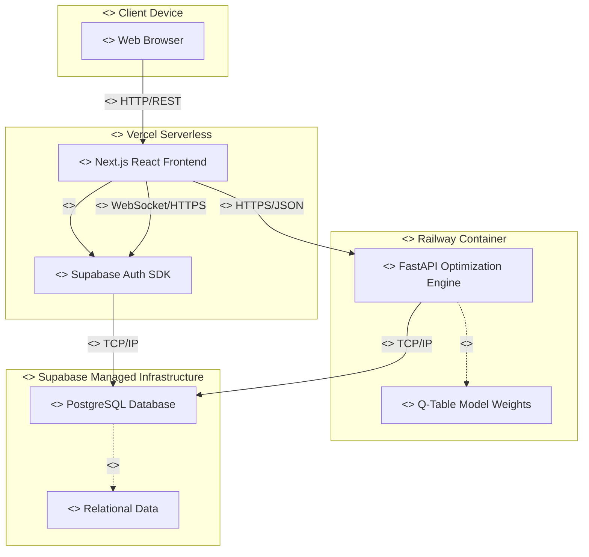
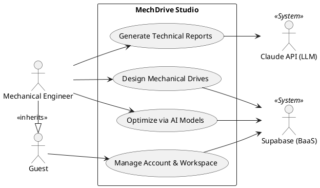
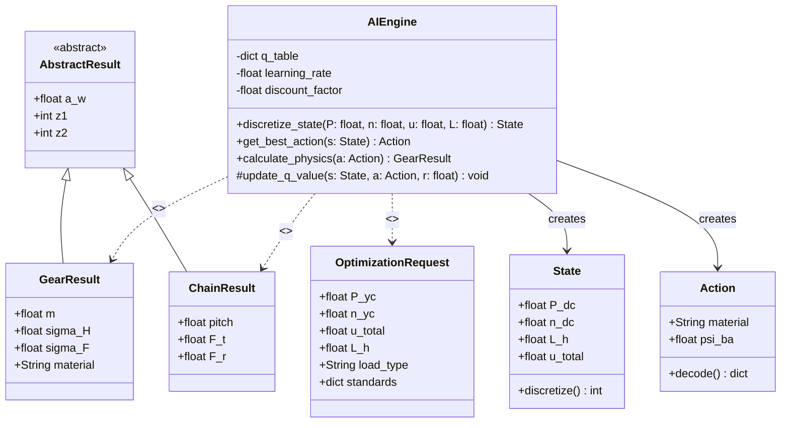
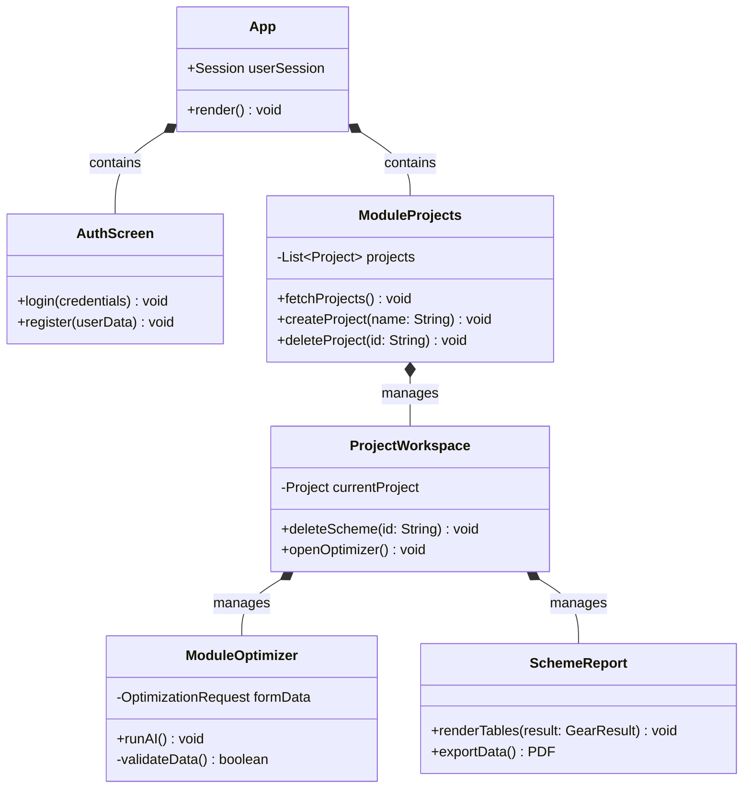
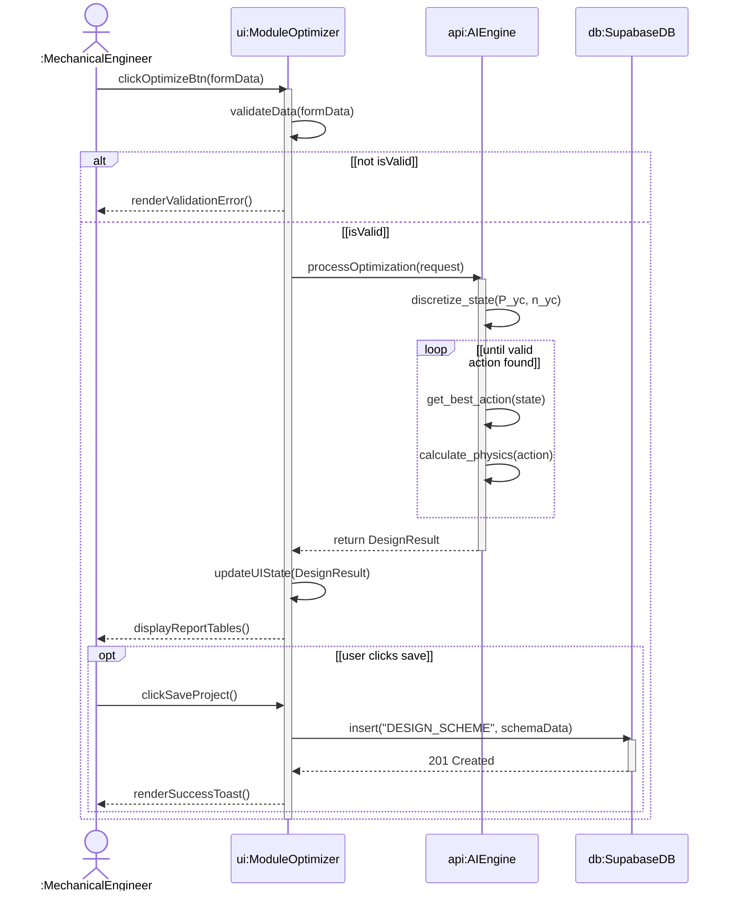
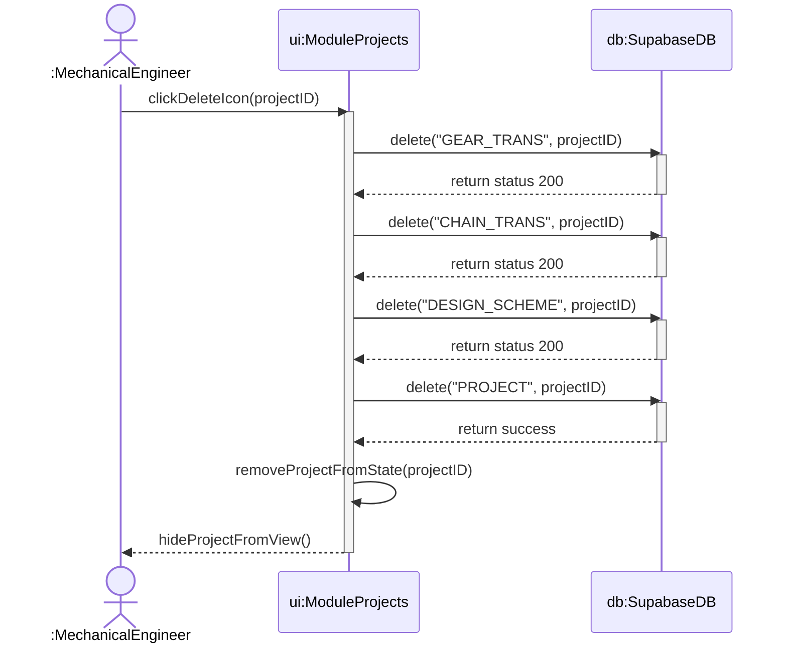

# MechDrive Studio: A Q-learning integrated platform for mechanical drive design

🌐 Live access: https://mechdrive.vercel.app/

## 1. Project team

| Student ID | Full name | Role & Responsibilities |
| --- | --- | --- |
| 2352286 | Dinh Nguy Nguyet Ha | Requirement specification, use case analysis, and system testing |
| 2352171 | Duong Le Nhat Duy | Database architecture design, SQL schema, and Supabase security policies |
| 2352715 | Tran Thien Loc | Frontend development (React/Next.js), UI/UX design, and API integration |
| 2353350 | Dinh Doan Vy | Backend API development, Q-Learning algorithm implementation, and standard data digitization |

## 2. Abstract

MechDrive Studio is a specialized web-based engineering platform dedicated to the calculation, design, and optimization of mechanical drive systems (specifically mixing drum drives). The project bridges traditional mechanical design theory with artificial intelligence. By applying the tabular Q-Learning reinforcement learning algorithm, the platform automatically analyzes dynamic input parameters to recommend optimal material configurations and transmission ratios. This significantly reduces manual trial-and-error loops and mitigates human calculation errors.

## 3. System architecture

The system is built upon a microservices-oriented architecture and a Backend-as-a-Service (BaaS) paradigm, ensuring high cohesion and low coupling.

> **Note:** For a comprehensive view of the system's component and deployment architecture, please see [System Deployment & Component View](docs/uml/5_Deployment_and_Component_Diagrams.md).



## 4. Software engineering: Requirements & Use Cases

### 4.1. User Stories & Scenarios

**US1: Authentication & Workspace Management**
- *Story*: As a mechanical engineer, I want to create an account and manage multiple independent design projects so that my work is securely stored and organized.
- *Scenario 1 (Success)*: User logs in, views the dashboard, and clicks "New Project". A new workspace is instantiated.
- *Scenario 2 (Exception)*: User attempts to create a project without a name. The system prevents creation and displays an error validation message.

**US2: AI-Assisted Optimization**
- *Story*: As an engineer, I want the system to automatically suggest the best gear material and width coefficient based on my required power and speed, so that I can minimize gearbox volume without violating stress limits.
- *Scenario 1 (Normal Load)*: User inputs $P = 3kW, n = 45rpm$. AI suggests C45 Steel with $\psi_{ba} = 0.3$.
- *Scenario 2 (Heavy Impact Load)*: User specifies heavy impact. The AI dynamically shifts the state and recommends a stronger material (e.g., 40X Steel) to prevent tooth fracture.

**US3: Report Generation**
- *Story*: As a student, I want to export or view a highly detailed step-by-step mechanical calculation report to verify the results against my textbook formulas.
- *Scenario*: Upon successful AI optimization, the user clicks "View Report". The system renders a technical specification sheet detailing $\sigma_H, \sigma_F, a_w, m$, and tension forces.

### 4.2. Use Case Diagram

> **Note:** The Use Cases have been meticulously detailed and split into 3 core subsystems matching the technical specification. For the comprehensive diagrams covering all detailed use cases, please refer to [Detailed Use Case Diagrams](docs/uml/1_Use_Case_Diagrams.md).

### High-Level System Use Case



## 5. Software engineering: Object-Oriented Design (Class Diagrams)

The system utilizes React functional components on the frontend and Pydantic data models on the backend.

### 5.1. Backend Class Diagram (FastAPI Models)

> **Note:** For comprehensive details on object-oriented structures, including visibility and interface realization, refer to [Class Diagrams](docs/uml/3_Class_Diagrams.md).



### 5.2. Frontend Component Diagram



## 6. Entity-relationship diagram (EERD)

<!-- INSERT YOUR EERD IMAGE HERE -->


<!-- ============================== -->

*Note: `STD_MOTOR`, `STD_CHAIN`, and `STD_MATERIAL` act as read-only lookup tables for the frontend and are not strictly bound by dynamic foreign keys to preserve historical design states.*

## 7. Comprehensive mechanical data flow

The mechanical calculation sequence strictly adheres to the standard engineering design process for a mixing drum drive. The data flow travels through 4 distinct phases:

1. **Phase 1: Electric Motor Selection**:
   - **Inputs**: Required power $P_{yc}$, required rotational speed $n_{yc}$.
   - **Flow**: Calculates necessary power $P_{ct}$ and synchronous speed $n_{sb}$ considering system efficiency $\eta_{total}$. Looks up the `STD_MOTOR` table to select a motor satisfying $P_{dm} \ge P_{ct}$ and $n_{dm} \approx n_{sb}$.
2. **Phase 2: Transmission Ratio Distribution**:
   - **Inputs**: Motor speed $n_{dm}$, working shaft speed $n_{lv}$.
   - **Flow**: Calculates total ratio $u_{total} = \frac{n_{dm}}{n_{lv}}$. Distributes into chain drive ratio ($u_x$) and gear drive ratio ($u_{br}$) using empirical tables or AI optimization constraints.
3. **Phase 3: Chain Drive Design**:
   - **Inputs**: $u_x$, power at input shaft $P_1$, speed $n_1$.
   - **Flow**: Determines pitch $p$, number of teeth $z_1, z_2$, center distance $a$, and chain tension forces $F_t, F_r$. Validates against `STD_CHAIN` constraints.
4. **Phase 4: Gear Drive Design (AI Optimized)**:
   - **Inputs**: $u_{br}$, power $P_2$, torque $T_2$, load type.
   - **Flow**: Triggers the AI Engine to select the best material and width coefficient. Resolves geometry ($a_w, m, z_1, z_2$) and executes stringent stress verification ($\sigma_H, \sigma_F$).

## 8. Q-learning algorithm formulation and parameter definitions

The AI module employs Tabular Q-Learning to simulate the iterative decision-making process of a mechanical engineer, eliminating manual trial-and-error.

### 8.1. Variables and state space (S)
The environment state $S$ is defined by discretizing continuous dynamic inputs to prevent state-space explosion. The discretization function $f(s)$ maps continuous ranges into discrete state bins:
- **$P_{dc}$ (kW)**: Electric motor power.
- **$n_{dc}$ (rpm)**: Electric motor rotational speed.
- **$L_h$ (hours)**: Total service life (calculated from shifts and years of operation).
- **$u_{total}$**: Total transmission ratio.
- **Load type**: Static, light impact, or heavy impact.

### 8.2. Action space (A)
An action $A$ represents a specific combination of critical design choices. The AI must select the optimal pair of:
1. **Material selection**: Standard steel grades (e.g., 40X, C45, 45 steel). This selection strictly determines the mechanical properties:
   - **$HB$**: Brinell hardness.
   - **$\sigma_b$ (MPa)**: Tensile strength.
   - **$\sigma_{ch}$ (MPa)**: Yield strength.
   - **$[\sigma_H]$ (MPa)**: Allowable contact stress (derived from $HB$ and base cycle factors).
   - **$[\sigma_F]$ (MPa)**: Allowable bending stress.
2. **$\psi_{ba}$**: Coefficient of gear width relative to center distance. It dictates the gear's compactness and affects load distribution concentration ($K_{H\beta}, K_{F\beta}$).

### 8.3. Reward function (R)
The reward function is mathematically shaped to encourage compactness while strictly enforcing endurance limits:
$$ R = R_{base} + Penalty $$

- **$R_{base}$**: Evaluates the geometric optimality. It is inversely proportional to the center distance $a_w$. Smaller, lighter gearboxes receive higher rewards:
  $$ R_{base} = \frac{100}{a_w} $$
- **Penalty**: Represents mechanical failure. A massive negative reward is applied if the calculated stresses violate material limits:
  $$ Penalty = \begin{cases} -1000 & \text{if } \sigma_H > [\sigma_H] \text{ or } \sigma_F > [\sigma_F] \\ 0 & \text{otherwise} \end{cases} $$

**Key Verification Variables Calculated by the Environment:**
- **$a_w$ (mm)**: Center distance, calculated primarily from $T_2$, $[\sigma_H]$, and $\psi_{ba}$.
- **$m$ (mm)**: Gear module, selected from standard tables based on center distance $a_w$ and normal ranges ($m = (0.01 \div 0.02) a_w$).
- **$z_1, z_2$**: Number of teeth for the pinion and gear.
- **$\alpha_{tw}$, $\beta$**: Working pressure angle and helix angle (for helical gears).
- **$\sigma_H$ (MPa)**: Actual working contact stress.
- **$\sigma_F$ (MPa)**: Actual working bending stress at the tooth root.

### 8.4. Q-value update rule
During offline training, the Q-Table is iteratively updated using the Bellman equation:
$$Q(S_t, A_t) \leftarrow Q(S_t, A_t) + \alpha \left[ R_{t+1} + \gamma \max_{a} Q(S_{t+1}, a) - Q(S_t, A_t) \right]$$
- **$\alpha$**: Learning rate.
- **$\gamma$**: Discount factor (prioritizing long-term design stability).

For production, the FastAPI server freezes the Q-Table and strictly exploits the highest Q-value corresponding to the current state: $\arg\max_a Q(S_{current}, a)$.

## 9. Sequence diagrams

### 9.1. Main Workflow Sequence (AI Integration)
> **Note:** For a complete suite of sequence diagrams covering all use cases, see [Sequence Diagrams](docs/uml/4_Sequence_Diagrams.md). Also, see [Activity Diagrams](docs/uml/2_Activity_Diagrams.md) for the equivalent workflow logic.



### 9.2. Project Management Sequence


## 10. Local deployment

### Backend (AI microservice)
Requires Python 3.9+.
```bash
cd backend
python -m pip install -r requirements.txt
uvicorn main:app --host 0.0.0.0 --port 8000
```

### Frontend (Web client)
Requires Node.js 18+. Configure the `.env.local` file with your Supabase keys before starting.
```bash
cd frontend
npm install
npm run dev
```

## 11. References

[1] Trinh Chat & Le Van Uyen (2006). Tinh toan thiet ke he dan dong co khi (Vol 1 & 2). Vietnam Education Publishing House.

[2] Watkins, C. J., & Dayan, P. (1992). Q-learning. Machine learning, 8(3), 279-292.

[3] Sutton, R. S., & Barto, A. G. (2018). Reinforcement learning: An introduction. MIT press.

[4] Internal documentation: Group_8_Final_Report.pdf (Faculty of Mechanical Engineering, Ho Chi Minh City University of Technology).

## 12. Notes

- Refer to the internal `Group_8_Final_Report.pdf` for comprehensive system test cases, reward shaping strategies, and continuous integration procedures.
- Production deployment requires updating the `allow_origins` CORS policy in `backend/main.py`.
