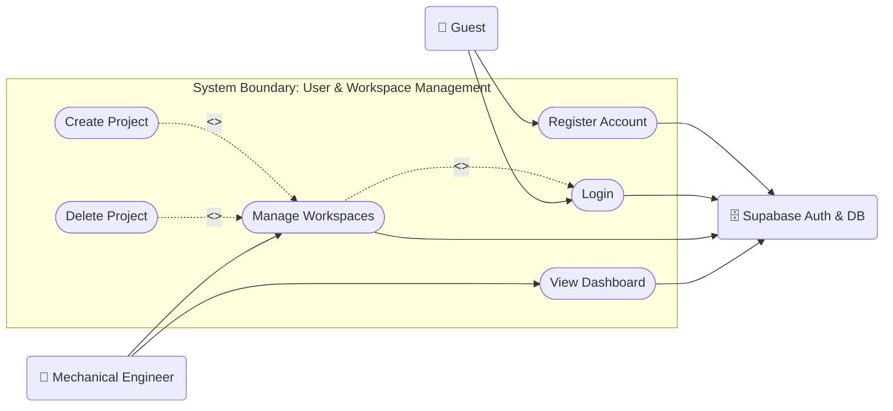
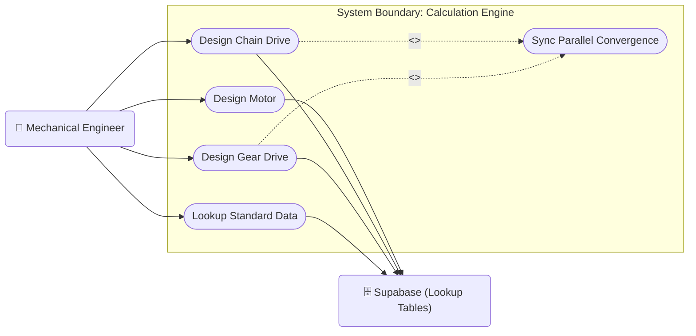
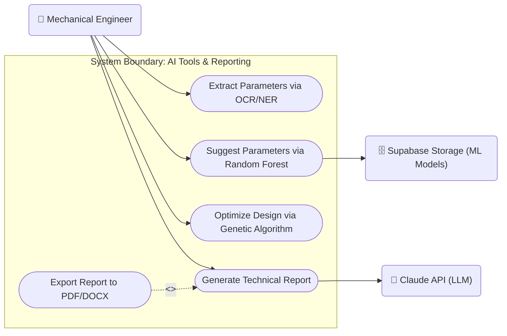

# 1. Use Case Diagrams

This document provides detailed Use Case Diagrams for the **MechDrive Studio** system.
To strictly follow UML theory:
- **System Boundary**: Represented by a `subgraph` containing all use cases.
- **Actors**: Primary actors (users) are placed on the left. Secondary actors (external systems/APIs) are placed on the right.
- **Stick Figures**: Mermaid doesn't natively support stick figure drawing in flowcharts, so we use the `🧍` emoji for human actors and server/robot emojis for external systems to visually distinguish them.
- **Granularity**: The diagrams are separated into 3 detailed subsystems based on the thesis specification (`DO_AN_DA_NGANH_SPEC.md`).

## 1.1 User & Workspace Management Subsystem

## 1.2 Mechanical Calculation Engine Subsystem (Core)

## 1.3 AI Tools & Reporting Subsystem

