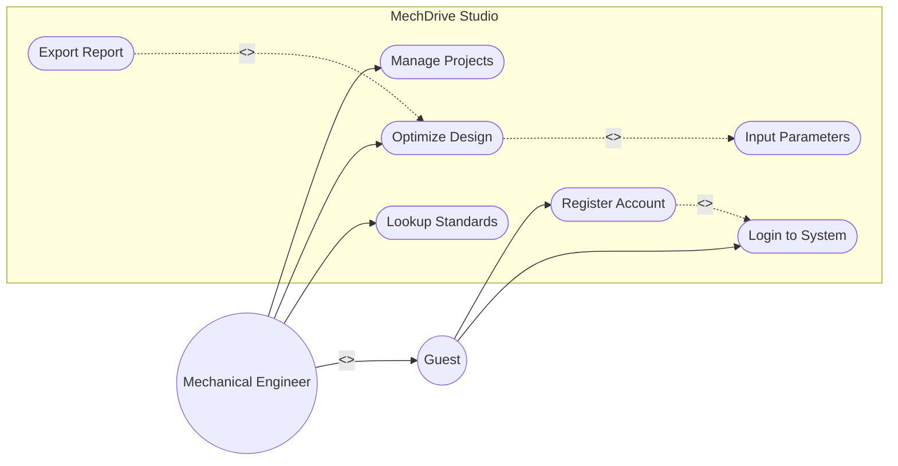

# 1. Use Case Diagrams

This document details the Use Case diagrams for MechDrive Studio, strictly adhering to UML standards with properly identified actors, relationships (`<<include>>`, `<<extend>>`), and system boundaries.

## 1.1 General System Use Cases

