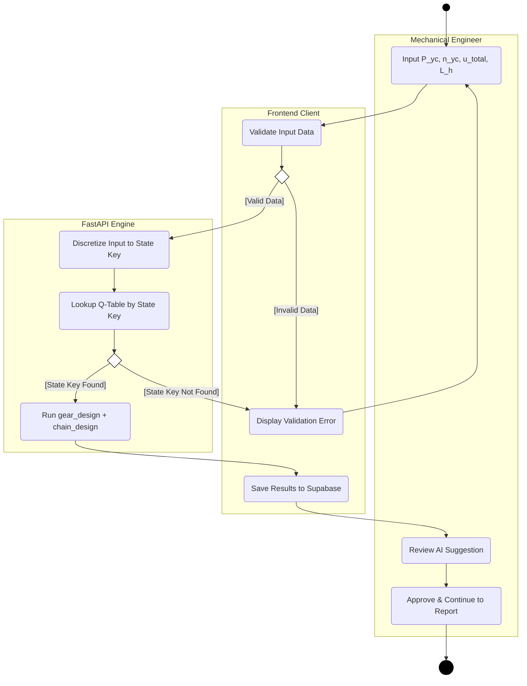

# 2. Activity Diagrams

This document details the Activity diagrams for the **MechDrive Studio** system, illustrating the flow of logic and operations.

## 2.1 AI Optimization Flow

```mermaid
flowchart TD
    classDef startEnd fill:#000,stroke:#000,color:#fff;
    classDef decision fill:#fff,stroke:#000,shape:diamond;

    Start(( )):::startEnd
    End((( ))):::startEnd
    
    subgraph User_Lane [Mechanical Engineer]
        A1(Input P_yc, n_yc, u_total, L_h)
        A8(Review AI Suggestion)
        A9(Approve & Continue to Report)
    end
    
    subgraph UI_Lane [Frontend Client]
        A2(Validate Input Data)
        D1{" "}:::decision
        A3(Display Validation Error)
        A7(Save Results to Supabase)
    end
    
    subgraph AI_Lane [FastAPI Engine]
        A4(Discretize Input to State Key)
        A5(Lookup Q-Table by State Key)
        D2{" "}:::decision
        A6(Run gear_design + chain_design)
    end
    
    Start --> A1
    A1 --> A2
    A2 --> D1
    
    D1 -->|"[Invalid Data]"| A3
    A3 --> A1
    
    D1 -->|"[Valid Data]"| A4
    A4 --> A5
    A5 --> D2
    
    D2 -->|"[State Key Not Found]"| A3
    
    D2 -->|"[State Key Found]"| A6
    A6 --> A7
    A7 --> A8
    A8 --> A9
    A9 --> End
```
