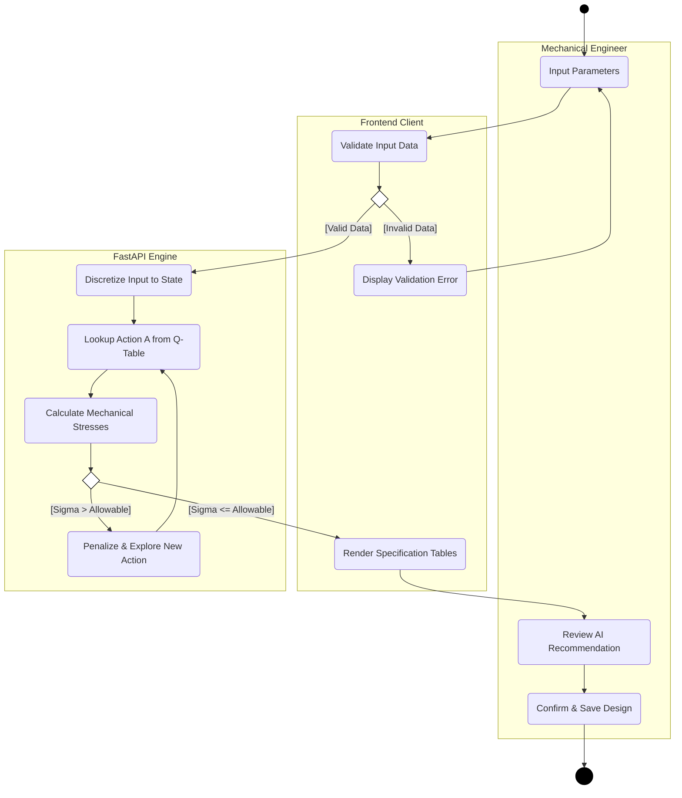

# 2. Activity Diagrams

These diagrams follow standard UML Activity Diagram conventions: 
- Rounded rectangles for actions
- Diamonds for decision nodes (empty inside, conditions placed on outgoing edges)
- Solid circles for start states and encircled solid circles for final states
- Swimlanes (partitions) for role separation to indicate responsibility.

## 2.1 AI Optimization Flow

