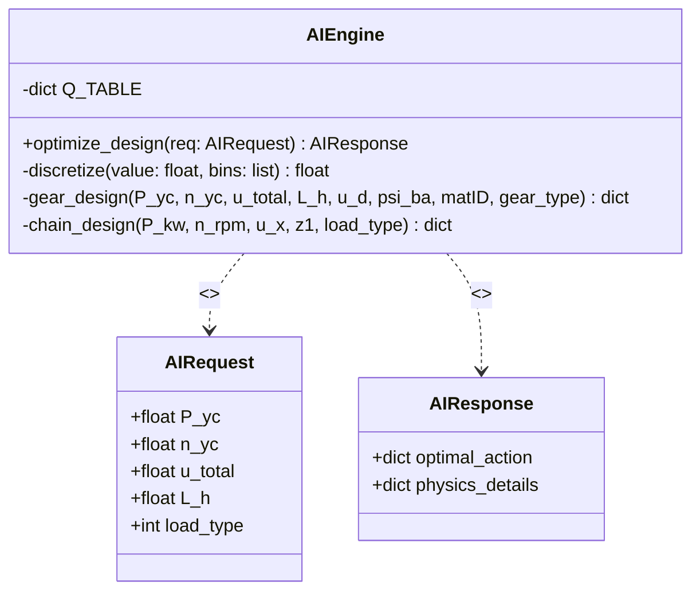
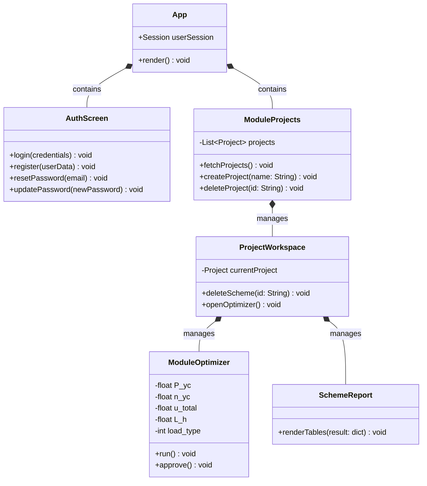

# 3. Class Diagrams

## 3.1 Backend AI Engine (Domain Model)

```mermaid
classDiagram
    class AIRequest {
        +float P_yc
        +float n_yc
        +float u_total
        +float L_h
        +int load_type
    }
    
    class AIResponse {
        +dict optimal_action
        +dict physics_details
    }
    
    class AIEngine {
        -dict Q_TABLE
        +optimize_design(req: AIRequest) AIResponse
        -discretize(value: float, bins: list) float
        -gear_design(P_yc, n_yc, u_total, L_h, u_d, psi_ba, matID, gear_type) dict
        -chain_design(P_kw, n_rpm, u_x, z1, load_type) dict
    }
    
    AIEngine ..> AIRequest : <<use>>
    AIEngine ..> AIResponse : <<creates>>
```

## 3.2 Frontend Architecture (Component Classes)

```mermaid
classDiagram
    class App {
        +Session userSession
        +render() void
    }
    
    class AuthScreen {
        +login(credentials) void
        +register(userData) void
        +resetPassword(email) void
        +updatePassword(newPassword) void
    }
    
    class ModuleProjects {
        -List~Project~ projects
        +fetchProjects() void
        +createProject(name: String) void
        +deleteProject(id: String) void
    }
    
    class ProjectWorkspace {
        -Project currentProject
        +deleteScheme(id: String) void
        +openOptimizer() void
    }
    
    class ModuleOptimizer {
        -float P_yc
        -float n_yc
        -float u_total
        -float L_h
        -int load_type
        +run() void
        +approve() void
    }
    
    class SchemeReport {
        +renderTables(result: dict) void
    }

    App *-- AuthScreen : contains
    App *-- ModuleProjects : contains
    ModuleProjects *-- ProjectWorkspace : manages
    ProjectWorkspace *-- ModuleOptimizer : manages
    ProjectWorkspace *-- SchemeReport : manages
```
