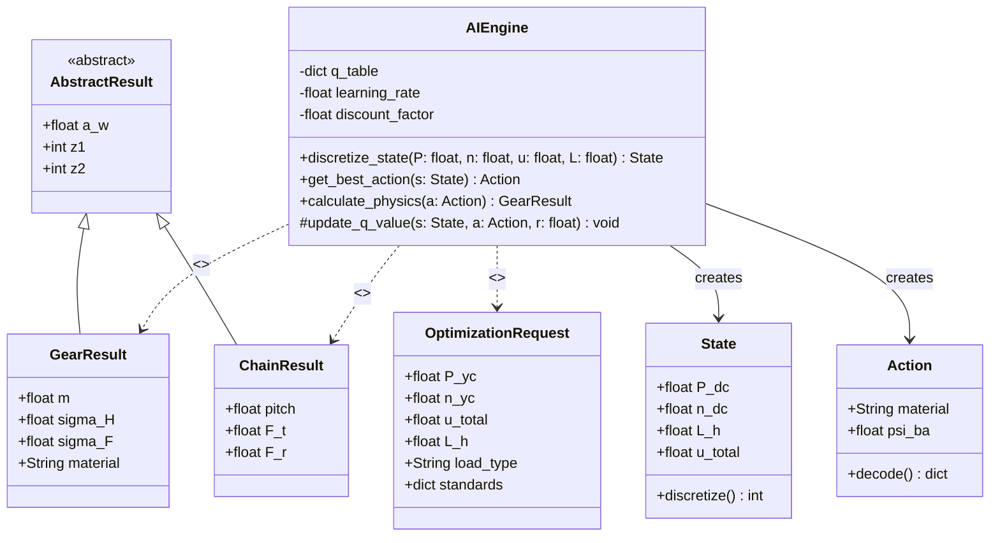
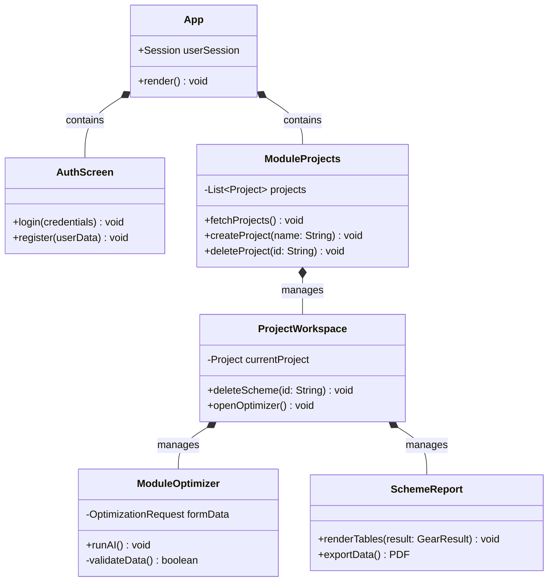

# 3. Class Diagrams

These diagrams detail the structural design, applying visibility indicators (`+` public, `-` private, `#` protected) and correct UML relationship notations (`-->` association, `o--` aggregation, `*--` composition, `..>` dependency, `<|--` inheritance).

## 3.1 Backend AI Engine (Domain Model)

## 3.2 Frontend Architecture (Component Classes)

