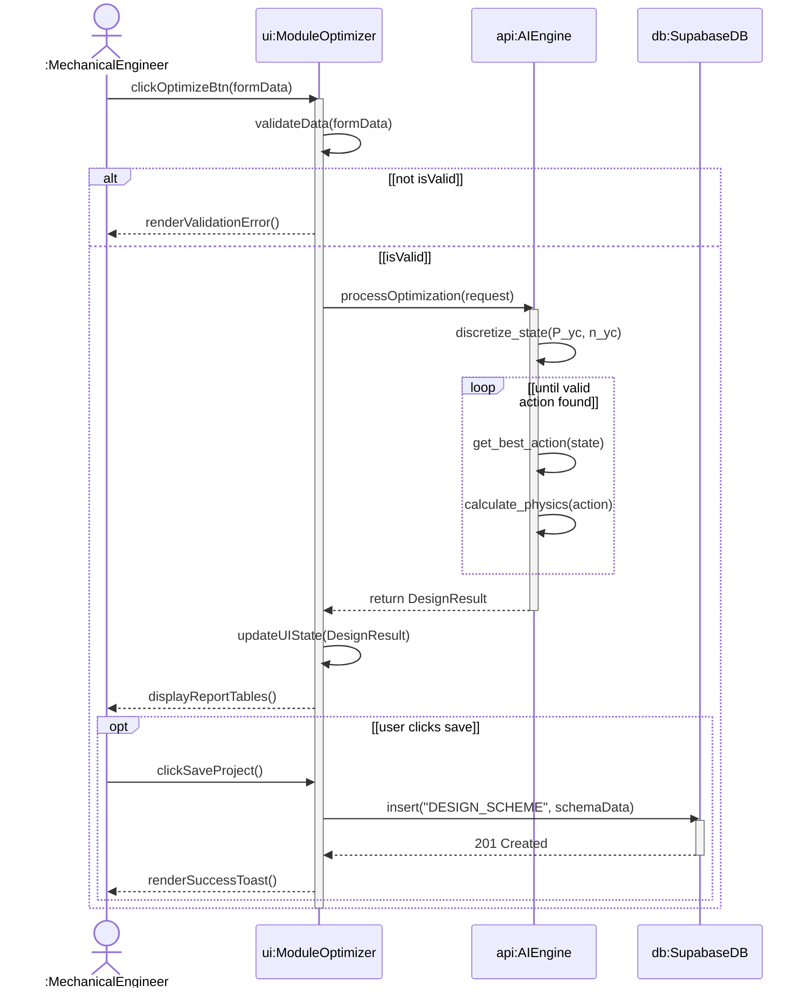
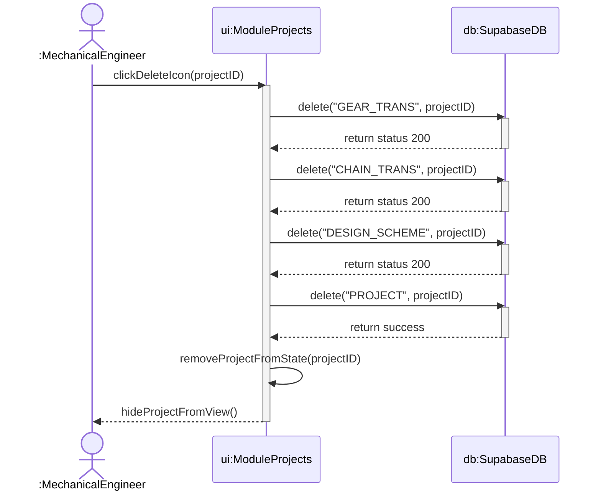

# 4. Sequence Diagrams

These sequence diagrams strictly follow UML guidelines:
- Method signatures as messages (directed to the receiving object)
- Proper use of lifelines and activation boxes
- Synchronous/asynchronous arrows
- Fragment operators (`alt` for alternatives, `opt` for optional, `loop` for iterations).

## 4.1 AI Optimization & Project Save Sequence

## 4.2 Project Deletion Sequence

