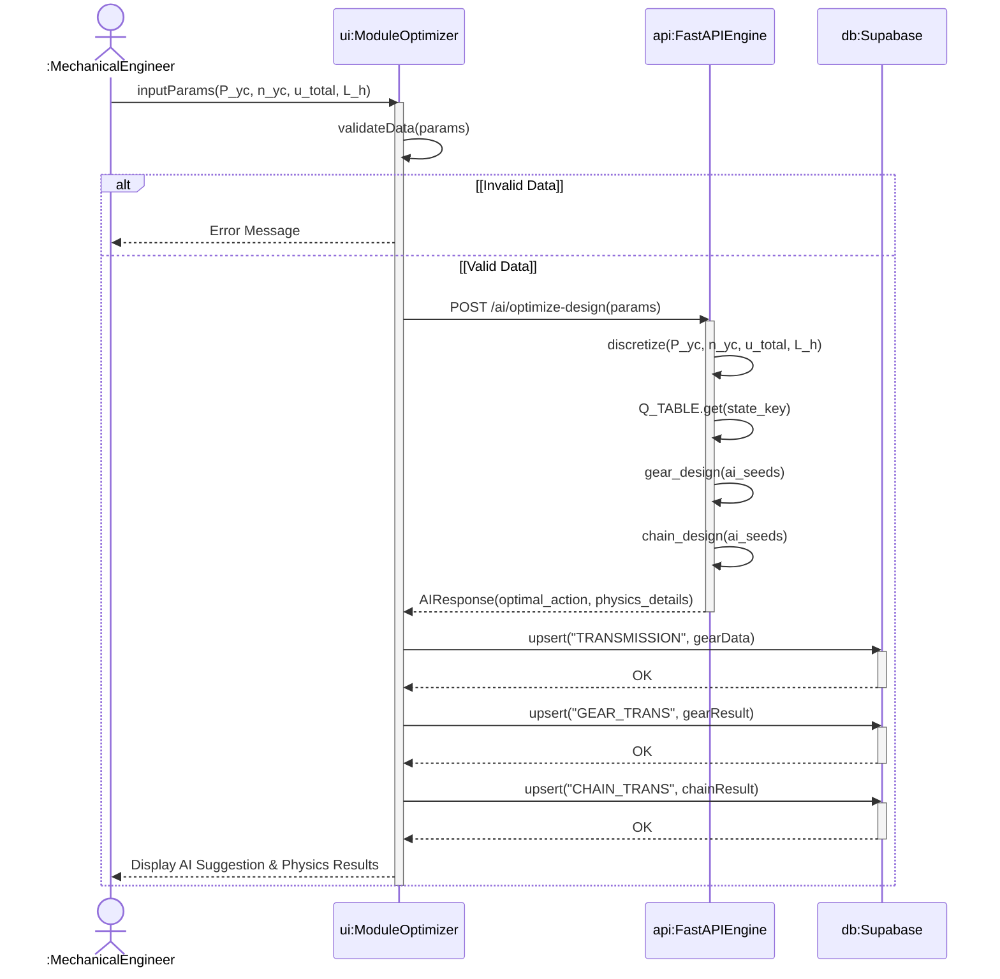
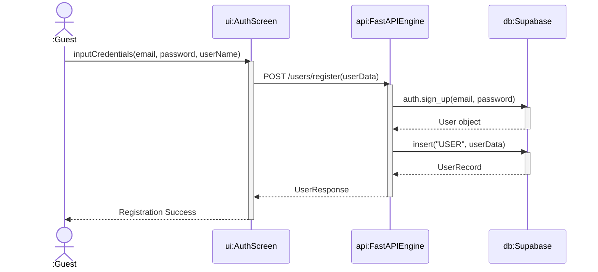
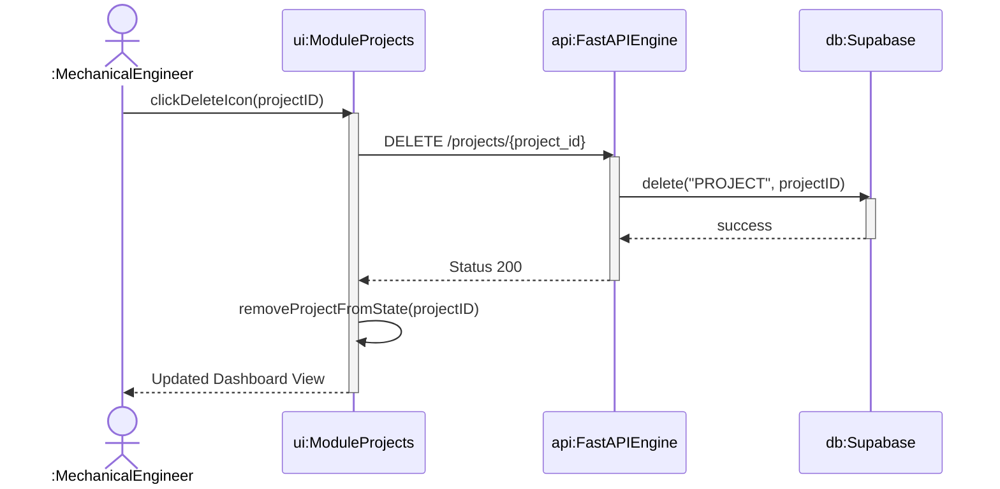

# 4. Sequence Diagrams

This document details the Sequence diagrams for the **MechDrive Studio** system, illustrating object interactions over time.

## 4.1 AI Optimization & Save Sequence

## 4.2 User Registration Sequence

## 4.3 Project Deletion Sequence

