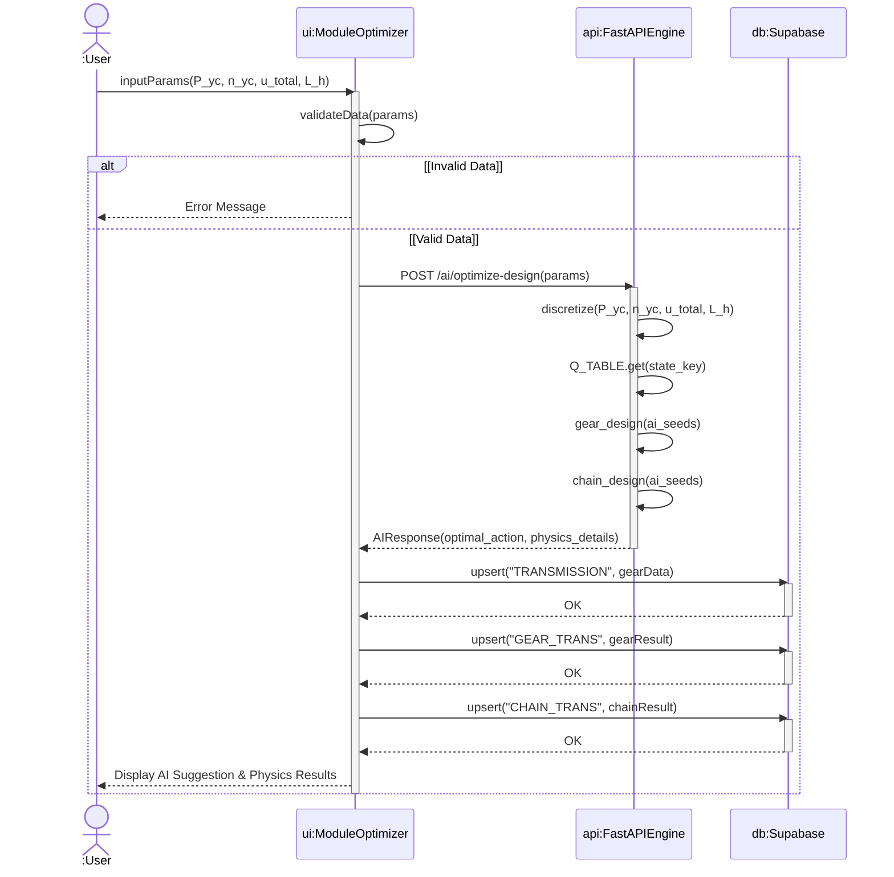
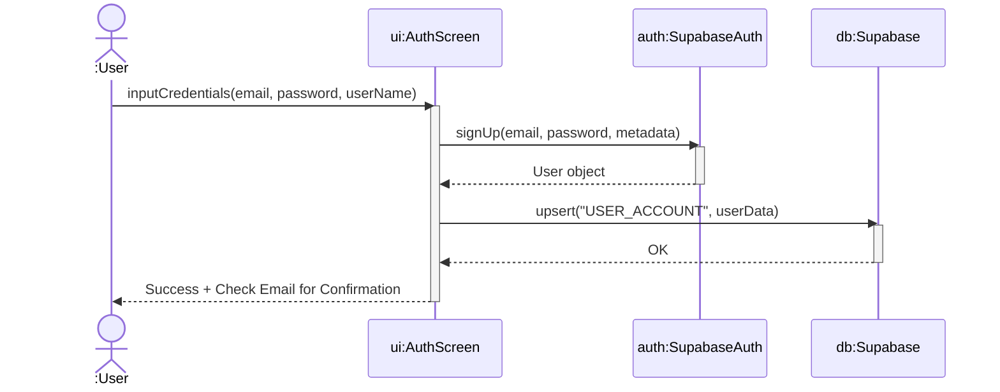
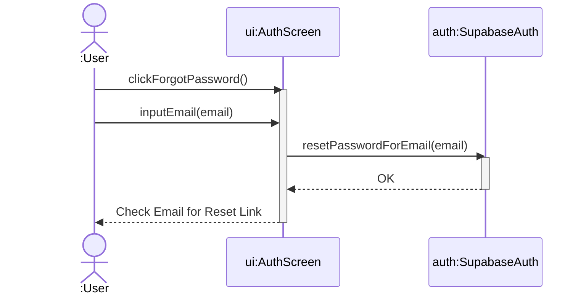
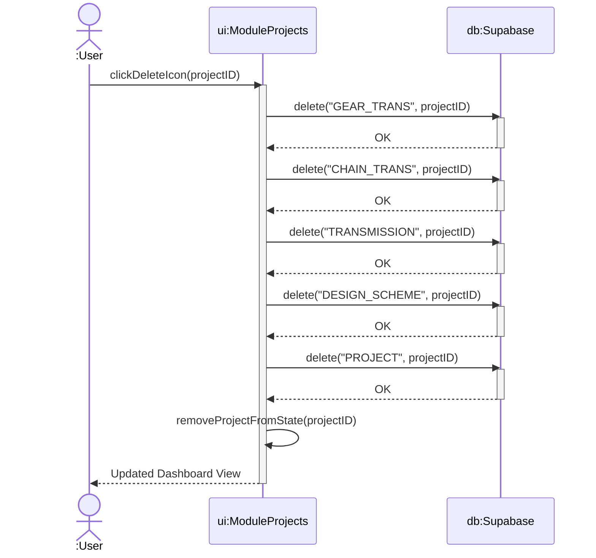

# 4. Sequence Diagrams

## 4.1 AI Optimization & Save Sequence

```mermaid
%%{init: {'theme': 'default', 'themeVariables': {'background': '#ffffff'}}}%%
sequenceDiagram
    actor User as :User
    participant UI as ui:ModuleOptimizer
    participant API as api:FastAPIEngine
    participant DB as db:Supabase

    User->>UI: inputParams(P_yc, n_yc, u_total, L_h)
    activate UI
    UI->>UI: validateData(params)
    
    alt [Invalid Data]
        UI-->>User: Error Message
    else [Valid Data]
        UI->>API: POST /ai/optimize-design(params)
        activate API
        
        API->>API: discretize(P_yc, n_yc, u_total, L_h)
        API->>API: Q_TABLE.get(state_key)
        API->>API: gear_design(ai_seeds)
        API->>API: chain_design(ai_seeds)
        
        API-->>UI: AIResponse(optimal_action, physics_details)
        deactivate API
        
        UI->>DB: upsert("TRANSMISSION", gearData)
        activate DB
        DB-->>UI: OK
        deactivate DB
        
        UI->>DB: upsert("GEAR_TRANS", gearResult)
        activate DB
        DB-->>UI: OK
        deactivate DB
        
        UI->>DB: upsert("CHAIN_TRANS", chainResult)
        activate DB
        DB-->>UI: OK
        deactivate DB
        
        UI-->>User: Display AI Suggestion & Physics Results
    end
    deactivate UI
```

## 4.2 User Registration Sequence

```mermaid
%%{init: {'theme': 'default', 'themeVariables': {'background': '#ffffff'}}}%%
sequenceDiagram
    actor User as :User
    participant UI as ui:AuthScreen
    participant Auth as auth:SupabaseAuth
    participant DB as db:Supabase

    User->>UI: inputCredentials(email, password, userName)
    activate UI
    
    UI->>Auth: signUp(email, password, metadata)
    activate Auth
    Auth-->>UI: User object
    deactivate Auth
    
    UI->>DB: upsert("USER_ACCOUNT", userData)
    activate DB
    DB-->>UI: OK
    deactivate DB
    
    UI-->>User: Success + Check Email for Confirmation
    deactivate UI
```

## 4.3 Reset Password Sequence

```mermaid
%%{init: {'theme': 'default', 'themeVariables': {'background': '#ffffff'}}}%%
sequenceDiagram
    actor User as :User
    participant UI as ui:AuthScreen
    participant Auth as auth:SupabaseAuth

    User->>UI: clickForgotPassword()
    activate UI
    
    User->>UI: inputEmail(email)
    UI->>Auth: resetPasswordForEmail(email)
    activate Auth
    Auth-->>UI: OK
    deactivate Auth
    
    UI-->>User: Check Email for Reset Link
    deactivate UI
```

## 4.4 Project Deletion Sequence

```mermaid
%%{init: {'theme': 'default', 'themeVariables': {'background': '#ffffff'}}}%%
sequenceDiagram
    actor User as :User
    participant UI as ui:ModuleProjects
    participant DB as db:Supabase

    User->>UI: clickDeleteIcon(projectID)
    activate UI
    
    UI->>DB: delete("GEAR_TRANS", projectID)
    activate DB
    DB-->>UI: OK
    deactivate DB
    
    UI->>DB: delete("CHAIN_TRANS", projectID)
    activate DB
    DB-->>UI: OK
    deactivate DB
    
    UI->>DB: delete("TRANSMISSION", projectID)
    activate DB
    DB-->>UI: OK
    deactivate DB
    
    UI->>DB: delete("DESIGN_SCHEME", projectID)
    activate DB
    DB-->>UI: OK
    deactivate DB
    
    UI->>DB: delete("PROJECT", projectID)
    activate DB
    DB-->>UI: OK
    deactivate DB
    
    UI->>UI: removeProjectFromState(projectID)
    UI-->>User: Updated Dashboard View
    deactivate UI
```
