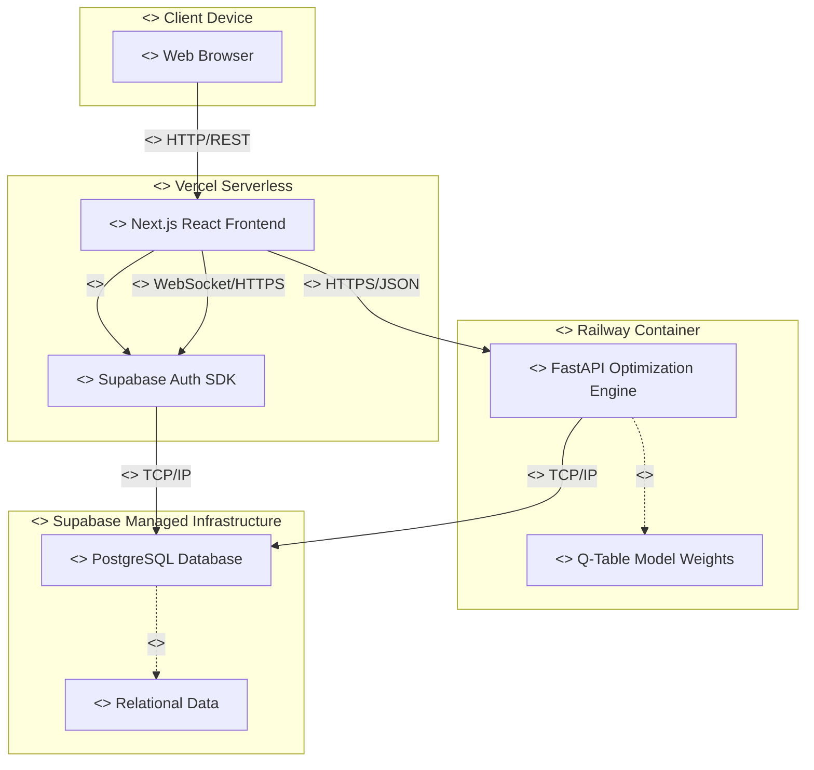

# 5. Deployment and Component Diagrams

Applying UML standard deployment artifacts (`<<artifact>>`), hardware/execution nodes (`<<device>>`, `<<execution environment>>`), and software components (`<<component>>`) with associated protocols and dependencies.

## 5.1 System Deployment & Component View

