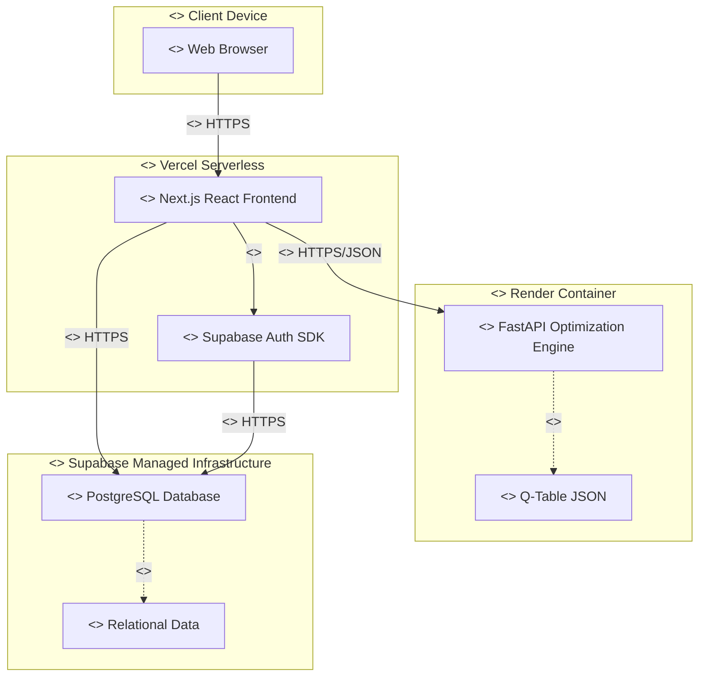

# 5. Deployment and Component Diagrams

This document details the Deployment and Component diagrams for the **MechDrive Studio** system's infrastructure.

## 5.1 System Deployment & Component View

